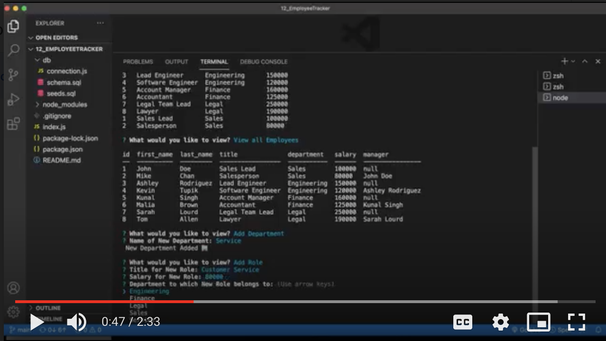

# **Employee Manager** [](https://opensource.org/licenses/MIT)

<h2>By Sally Alvarenga</h2>

---

## Description

In this application I created a content management systems (CMS), without starter code, that will allow a user to view and manage a database of employees and their respective roles inside a company. My application is a command-line application that uses Node.js, Inquirer, and MySQL.

My application is able to accept user input to determine if they want to; view all departments, view all roles, view all employees, add a department, add a role, add an employee, and update an employee role. Each of these options render various tables or inquire prompts that adds or updates the desired information in the database.

The following video shows an example of my application being used from the command line:

[](https://drive.google.com/file/d/1DZ5ITuCVmlOKO75TgvER0EVzzPgfbjz3/view?usp=sharing)

<summary>Table of Contents</summary>
  <ol>
    <li><a href="#Installation">Installation</a></li>
    <li><a href="#usage">Usage</a></li>
    <li><a href="#license">License</a></li>
    <li><a href="#tests">Tests</a></li>
    <li><a href="#questions">Questions</a></li>
  </ol>

---

## Installation

Run and install the database in the schema by running the following in the terminal:

```md
mysql -u root -p
password:
source schema.sql
```

Run and install npm packages and seeds by running the following in the terminal:

```md
npm install
npm run seeds
```

## Usage

Type into the terminal:

```md
To start application: node index.js
Use the arrows to scroll and make selections.
To exit the application: control + C
```

## License

Distributed under the MIT License

    Copyright (c) 2021 Sally Alvarenga

## Tests

Testing and Debugging has already been done by the developer and but feedback will be appreciated for further development.

---

## Questions

For further questions and inquiries please feel free send me an email or a direct message on GitHub

Sally Alvarenga - sallyalvarenga35@gmail.com

GitHub Profile: [@salvarenga74](https://github.com/salvarenga74)
